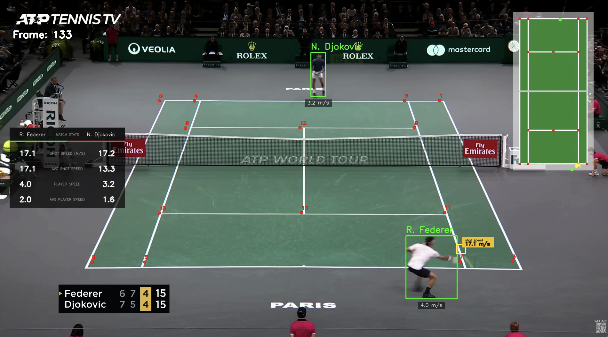

# Tennis-Vision

A computer vision pipeline for analyzing broadcast tennis footage — detecting and tracking players and the ball, calibrating real-world court geometry from a trained keypoint model, and deriving live match statistics (shot speed, player movement speed) through homography-based coordinate mapping.

## Demo

Initial YOLO player/ball detection:


Final output — tracking, court calibration, mini-court, and live match stats:



## What it does

- **Player tracking** — YOLO11 + tracking, with automatic filtering to isolate the two actual players from officials, ball kids, and umpires
- **Ball tracking** — custom-trained YOLO model, with interpolation to smooth gaps in detection between frames
- **Court calibration** — a ResNet50 regression model trained to predict 14 court keypoints (corners, service lines, center marks) directly from a single frame
- **Homography mapping** — converts pixel positions (players, ball) into real-world court coordinates using known court dimensions and player height as calibration references
- **Mini-court visualization** — a live top-down court overlay showing player and ball positions in real time, including a fading ball trajectory trail
- **Match statistics** — shot speed and player movement speed, computed in m/s from real-world distances and elapsed time, shown as both live and running-average values
- **On-court stat tags** — a fading "shot speed" tag appears beside whichever player just hit the ball; a persistent tag tracks current movement speed
- **Named player overlays** — bounding boxes labeled with player names rather than raw track IDs

## Pipeline

Raw video → player detection & tracking → ball detection & tracking + interpolation → court keypoint detection → player filtering → homography (pixel → real-world coordinates) → shot detection → speed/stats calculation → rendering (boxes, names, mini-court, stat panels, tags) → output video

## Tech stack

- **Detection/tracking**: Ultralytics YOLO11 (players), custom-trained YOLO (ball)
- **Court calibration**: PyTorch, ResNet50 (transfer learning, fine-tuned regression head for 14 keypoints)
- **Data handling**: pandas
- **Rendering**: OpenCV

## Known limitations

- Shot speed is calculated as a rally-average (distance covered by the ball divided by elapsed time between consecutive shots), not peak radar speed at contact — figures will read lower than TV-quoted numbers.
- Court calibration is tuned for a standard elevated center-court broadcast angle; a different camera position would likely need retraining.
- Player identification is a manual name mapping rather than automatic detection (e.g. jersey OCR).

## Setup

```bash
pip install -r requirements.txt
```

Update model and video paths in `main.py`, then:

```bash
python main.py
```

Player/ball detections are cached to `tracker_stubs/` after the first run to speed up iteration during development.
